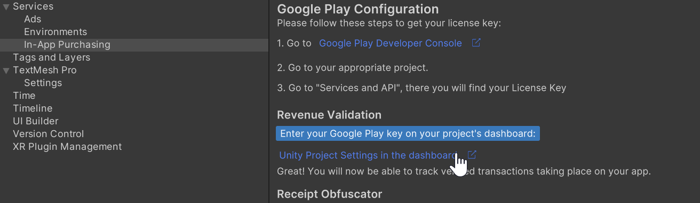
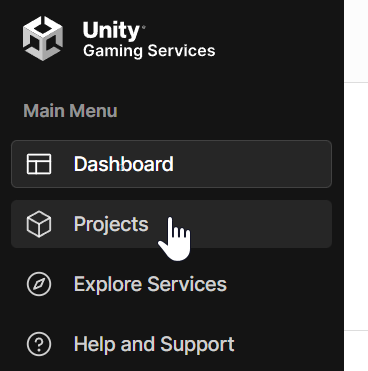
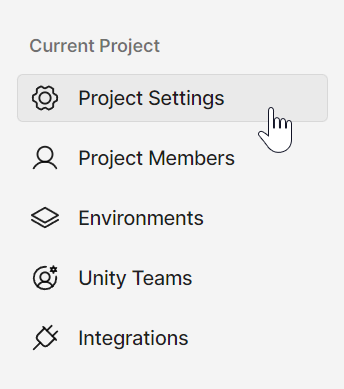

# Setting Google Public Key

It is possible to set the Google Public Key in the Project Settings in the dashboard.

## From the Unity Editor

1. Follow the steps in [Getting Started Guide](GettingStarted.md) to go to the In-App Purchasing service window
2. Follow the steps to click the link to the dashboard in the `Revenue Validation` section of the In-App Purchasing service window

3. In the section `In-app purchase (IAP) settings` edit the field `Google License Key`

## From the project dashboard

1. Go to the [Unity Dashboard](https://dashboard.unity3d.com/landing)
2. Open the left menu and select `Project`, select your project from the list, then, again on the left menu, select `Project Settings` under `Current Project`

3. In the section `In-app purchase (IAP) settings` edit the field `Google License Key`

