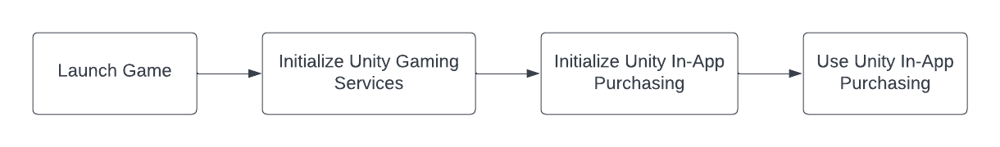

# Initialization

In order to use the **Unity In-App Purchasing** package, **Unity Gaming Services** needs to be initialized first followed by the initialization of **Unity In-App Purchasing**.

The following diagram visually describes steps to initialize Unity In-App Purchasing.

