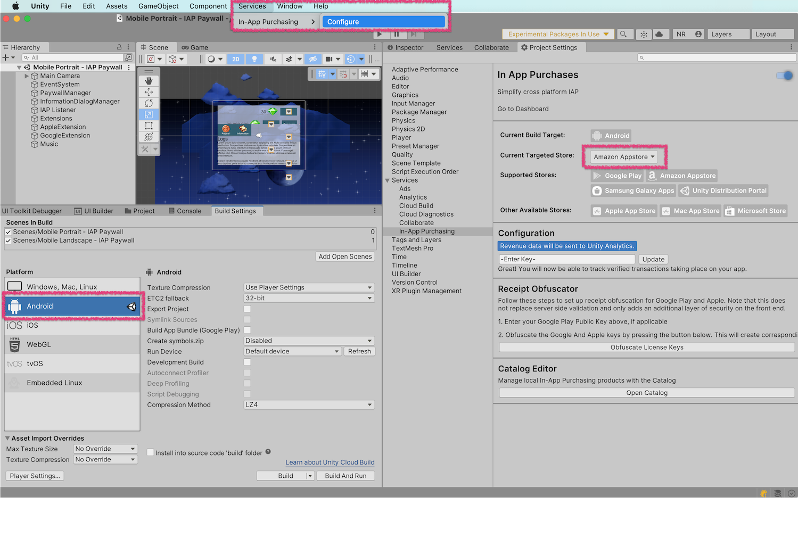
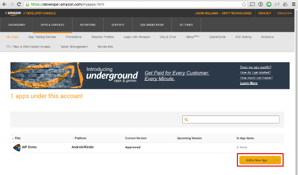
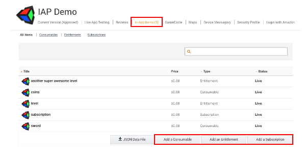

# Configuration for the Amazon Appstore

##Introduction

This guide describes the process of setting up the Amazon Appstore for use with the Unity in-app purchasing (IAP) system. This includes establishing the digital records and relationships that are required to interact with the Unity IAP API, setting up an Amazon developer account, and testing and publishing a Unity IAP application. 

As with other platforms, the Amazon store allows for the purchase of virtual goods and managed products. These digital products are identified using a string identifier and an additional type to define durability, with choices including subscription (capable of being subscribed to), consumable (capable of being rebought), and non-consumable (capable of being bought once).

##Cross-store implementation of in-app purchases

There are cross-store installation issues with publishing to multiple Android IAP stores (e.g. Amazon and Google) simultaneously and shared Android bundle identifiers. Please see the page on [Cross-store installation issues with Android in-app purchase stores](UnityIAPCrossStoreInstallationIssues) to learn more.

##Amazon Appstore

###Getting started

1. Set up an Amazon developer account at the [Amazon developer portal](https://developer.amazon.com/).
1. Write a game implementing the Unity IAP API. For reference, see the guides on [Unity IAP initialization](UnityIAPInitialization) and [Integrating Unity IAP in your game](https://unity3d.com/learn/tutorials/topics/analytics/integrating-unity-iap-your-game). Use the Amazon Appstore for apps with no restrictions on IAP items.

###Device setup

1. For Android devices, download and install the [Amazon Appstore](https://www.amazon.com/appstore_android_app).
2. For FireOS devices, the Amazon Appstore should come pre-installed.<br/><br/>**Note**: Though you may freely target FireOS devices, FireOS is not a Unity-supported platform.<br/><br/>
3. Once you have installed the Amazon Appstore, install the [Amazon App Tester](http://www.amazon.com/Amazon-App-Tester/dp/B00BN3YZM2/).

     
1. Set up the Android SDK
    1. To install and watch the Android debug log, ensure you have the [Android SDK](https://developer.android.com/studio/install.html) installed. Download the relevant command line tools package from the Android SDK install page and extract them to your computer.
    1. Confirm that the SDK recognizes the attached Android device through the command-line adb tool. For example:
    
````
|[11:07:01] user@laptop:/Applications | $ adb devices
List of devices attached
00DA0807526300W5	device
````

###Unity app setup

Setting up to use Unity's IAP takes a few steps.

1. Import the Unity IAP plug-in. See [Setting up Unity IAP](UnityIAPSettingUp) for more information (Unity 5.3 or higher).
1. Set the IAP target store. You should already have an Android app set up. Set the target store using __Unity IAP's Window > Unity IAP > Android > Target Amazon__ menu item. This is used to toggle between Google, Amazon, and other Android stores.

    

Alternatively, call the API: 

````
UnityPurchasingEditor.TargetAndroidStore(AndroidStore.AmazonAppStore)
````

###Amazon Appstore setup

It's not necessary to download Amazon's native IAP plug-in when preparing to use the Amazon stores, as all of the functionality it provides is already included in Unity's IAP service.

1. Add your app. From the Amazon Developer Portal select __Add a New App__.

    

1. Set up your catalog. Using the product descriptions you prepared earlier, add the items to the Amazon catalog using the Amazon Developer Portal. Navigate to your app's page, and find the __In-App Items section__. Use the __Add a Consumable__, __Add an Entitlement__, or __Add a Subscription__ buttons to set up your catalog.

    


