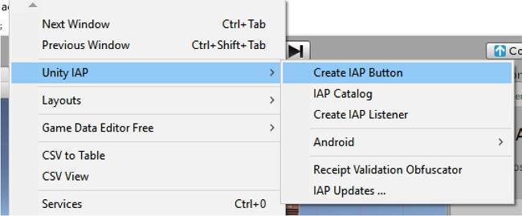
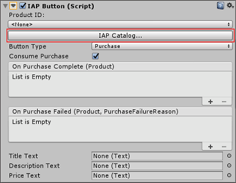
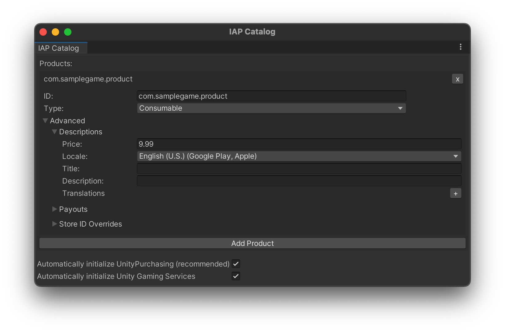
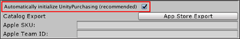
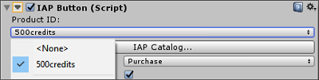
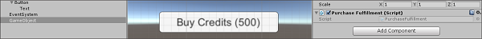
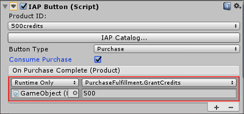
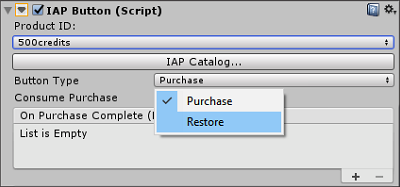
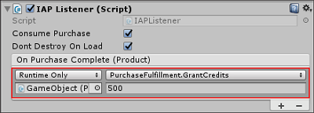

# Codeless IAP

__Codeless IAP__ is the easiest way to implement in-app purchases in your Unity app. The Unity Editor offers an interface for configuring basic IAP integration using minimal script writing.

Codeless IAP handles the actual IAP transaction without requiring any code. Implementing Codeless IAP is a two-step process using the Editor: 

1. [Add __IAP Buttons__ to your game](#IAPButtons).
2. [Define your __Products__ in the __IAP Catalog__](#PopulatingProducts). 

The __Unity Purchasing__ system configures the Products you populate in the catalog at run time. When players select an __IAP Button__, it initiates the purchase flow for the associated Product.

**Note**: You still need to use scripting to define how players access their newly purchased content. For more information, see the [**Purchase fulfillment**](#PurchaseFulfillment) section below. 

## Implementing Codeless IAP
Before starting, install the latest Unity IAP SDK. See documentation on [**Setting up Unity IAP**](UnityIAPSettingUp.md) for more information.

<a name="IAPButtons"></a>
### Adding IAP Buttons to your Scene
To add an __IAP Button__ to your Scene, in the Unity Editor, select __Window &gt; Unity IAP &gt; Create IAP Button__.




<a name="PopulatingProducts"></a>
### Populating Products in the IAP Catalog
Open the __IAP Catalog__ GUI one of two ways:
 
* Select  __Window &gt; Unity IAP &gt; IAP Catalog__.
* Or, with your __IAP Button__ selected, locate its __IAP Button (Script)__ component in the Inspector, then click __IAP Catalog…__. 



Next, use the GUI to define the following attributes for each Product in your catalog.

* A __Product ID__ with which to communicate to app stores (note that you can override this ID with unique store-specific IDs through the __Advanced__ option).
* A __Product Type__ (__Consumable__, __Non-Consumable__, or __Subscription__).



**Note**: The __IAP Catalog__ GUI provides additional tools for configuring your Products. Before [exporting a catalog](#Exporting) for upload to its respective store, you must populate description and pricing information as well. For detailed information on these settings, see documentation on [**Defining Products**](UnityIAPDefiningProducts.md).

### Automatically initializing `UnityPurchasing`
The IAP SDK must initialize in order for in-app purchasing to work. This occurs automatically when the first instance of a Codeless __IAP Button__ or [__IAP Listener__](#IAPListeners) loads at run time. However, you may need to initialize the SDK before an IAP Button or IAP Listener appears in your game. In these cases, check __Automatically initialize UnityPurchasing (recommended)__ at the bottom of the __IAP Catalog__ window. This ensures that [```UnityPurchasing```](xref:UnityEngine.Purchasing.UnityPurchasing) initializes immediately when the application starts, and eliminates dependencies on the codeless instances’ lifecycles. 



In order to work, your catalog must contain at least one Product. 

**Note**: You can use auto-initialize together with IAP Buttons or Listeners. In this case, the SDK initializes when the game starts instead of when the first instance of an IAP Button or Listener loads in the Scene. However, you should not enable auto-initialize if you also initialize manually in a script, as this may cause errors. 

<a name="PurchaseFulfillment"></a>
### Purchase fulfillment
When your catalog contains at least one Product, you can define __IAP Button__ behavior when the purchase completes or fails. 

1. Select your __IAP Button__ in the Scene view, then locate its __IAP Button (Script)__ component in the Inspector.
2. Select the Product to link to the __IAP Button__ from the __Product ID__ drop-down list.
   
3. Create your own function that provides purchase fulfillment, or import an Asset that does this (see code sample, below).
4. Apply your purchase fulfilment script to a GameObject as a component.
   
5. Return to the  __IAP Button (Script)__ component in the Inspector, and click the plus (__+__) button to add a function to the __On Purchase Complete (Product)__ list.
6. Drag the GameObject with the purchase fulfillment script onto the __On Purchase Complete (Product)__ event field (illustrated below), then select your function from the dropdown menu.
   

**Fulfillment script code sample**:

```
public void GrantCredits (int credits){
    userCredits = userCredits + credits;
    Debug.Log(“You received “ + credits “ Credits!”);
} 
```

Run your game to test the __IAP Button__.

## Extended functionality

<a name="Exporting"></a>
### Exporting to an app store
In order for purchases to function, you must configure your catalog on the corresponding app store. To do so, you can export your Product Catalog as a CSV file to Google Play, or as an XML file through Apple’s Application Loader to the iTunes Store. 

#### Google Play
To export your Product Catalog for Google Play:

1. In the __IAP Catalog__ window (__Window &gt; Unity IAP &gt; IAP Catalog__), ensure that each Product has the following defined:<br/>* __ID__ <br/>* __Type__ <br/>* __Title__ and __Description__ <br/>* __Price__ or __Pricing Template__ ID
2. Scroll down, and select __App Store Export__.
3. Select __Google Play CSV__.
4. Choose a location in which to save the CSV file.

For complete guidance on uploading your exported catalog to Google Play, see the [Google in-app billing](https://developer.android.com/google/play/billing/billing_admin.html#billing-list-setup) documentation on the [Android Developers website](https://developer.android.com).

#### Apple iTunes
To export your Product Catalog for Apple iTunes:

1. In the **IAP Catalog** window (**Window** &gt; **Unity IAP** &gt; **IAP Catalog**), ensure that each Product has the following defined:<br/>* **ID** <br/>* **Type** <br/>* **Title** and **Description** <br/>* **Price Tier** and **Screenshot path** <br/>* 
**Apple SKU** (found in [iTunes Connect](https://itunesconnect.apple.com)) <br/>* **Apple Team ID** (found on [Apple’s developer website](https://developer.apple.com))
2. Scroll down, and select **App Store Export**.
3. Select **Apple XML Delivery**.
4. Choose a location in which to save the XML file.

For complete guidance on importing through Apple’s Application Loader, see the [Application Loader](https://itunesconnect.apple.com/docs/UsingApplicationLoader.pdf) documentation on the [iTunes Connect website](https://itunesconnect.apple.com).

### Restore Button
Some app stores, including iTunes, require apps to have a __Restore__ button. Codeless IAP provides an easy way to implement a restore button in your app. 

To add a __Restore__ button:

1. Add an __IAP Button__ to your Scene (**Window** &gt; **Unity IAP** &gt; **Create IAP Button**).
2. With your __IAP Button__ selected, locate its **IAP Button (Script)** component in the Inspector, then select **Restore** from the **Button Type** drop-down menu (most of the component's other fields will disappear from the Inspector view).
   

When a user selects this button at run time, the button calls the purchase restoration API for the current store. This functionality works on the iOS App Store, the Mac App Store, the Windows Store, Samsung Apps, and the Cloud Moolah app store. You may want to hide the __Restore__ button on other platforms.

If the restore succeeds, Unity IAP invokes the __On Purchase Complete (Product)__ function on the __IAP Button__ associated with that Product. 

For more information, see the documentation on [**Restoring purchases**](UnityIAPRestoringTransactions.md).

<a name="IAPListeners"></a>
### IAP Listeners
Codeless IAP dispatches successful and failed purchase events to an active __IAP Button__ component in the hierarchy. However, there may be times when it is difficult or undesirable to have an active __IAP Button__ when handling a successful purchase. For example, if a purchase is interrupted before completing, Unity IAP attempts to process the purchase again the next time it is initialized. You may want this to happen immediately after the app launches, in which case an __IAP Button__ wouldn’t make sense. Codeless IAP includes the __IAP Listener__ component precisely for these cases. An active __IAP Listener__ in the Scene hierarchy receives any purchase events that cannot be dispatched to an __IAP Button__.

To add an __IAP Listener__:

1. In the Unity Editor, select __Window &gt; Unity IAP &gt; Create IAP Listener__.
2. Follow the steps for [writing a purchase fulfillment script as a GameObject component](#PurchaseFulfillment).
3. Select the __IAP Listener__ in the Scene and locate its **IAP Listener (Script)** component in the Inspector, then click the plus (**+**) button to add a function to the **On Purchase Complete (Product)** list.
4. Drag the GameObject with the purchase fulfillment script onto the event field in the component’s Inspector, then select your function from the dropdown menu.
   

### Accessing Unity IAP’s extended functionality
The Codeless IAP feature does not expose most of Unity IAP’s [extended functionality](UnityIAPStoreExtensions.md). However, Codeless IAP is implemented on top of the existing scripting APIs, so you can modify much of its functionality in the _IAPButton.cs_ script (_Assets/Plugins/UnityPurchasing/script/IAPButton.cs_) to suit your needs.

To use Unity IAP’s extended functionality, access the Unity IAP [```IStoreController```](xref:UnityEngine.Purchasing.IStoreController) and [```IExtensionProvider```](xref:UnityEngine.Purchasing.IExtensionProvider) instances returned by [```IStoreListener.OnInitialized```](xref:UnityEngine.Purchasing.IStoreListener).


