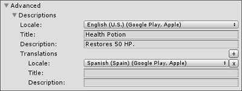
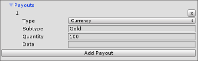

# IAP Catalog

To open the __IAP Catalog__ GUI one of two ways:

* Select  __Services &gt; In-App Purchasing &gt; IAP Catalog__.
* Or, with your __IAP Button__ selected, locate its __IAP Button (Script)__ component in the Inspector, then click __IAP Catalog…__.

## Populating Products in the IAP Catalog

Next, use the GUI to define the following attributes for each Product in your catalog.

* A __Product ID__ with which to communicate to app stores (note that you can override this ID with unique store-specific IDs through the __Advanced__ option).
* A __Product Type__ (__Consumable__, __Non-Consumable__, or __Subscription__).

**Note:**
- The __IAP Catalog__ GUI provides additional tools for configuring your Products. Before [exporting a catalog](#Exporting-to-an-app-store) for upload to its respective store, you must populate description and pricing information as well.
- The __IAP Catalog__ acts as a Product catalog dictionary, not as an inventory manager. You must still implement the code that handles conveyance of the purchased content.

## Advanced
This section defines the metadata associated with your Product for use in an in-game store.

### Descriptions
This sections defines the [descriptions of a product](DefiningProductsOverview.md#Descriptions).

Add __Translations__ for the __Title__ and __Description__ fields by clicking the plus (__+__) icon and selecting an additional locale. You can add as many translations as you like.

### Payouts
This sections defines the [payout of a product](DefiningProductsOverview.md#Payouts).

### Store ID Overrides
This sections defines the [Store ID overrides of a product](DefiningProductsOverview.md#Store-ID-Overrides).

