#Configuring for Google Play Store

## Introduction

This guide describes the process of establishing the digital records and relationships necessary for a Unity game to interact with an In-App Purchase Store. The [Unity IAP](UnityIAP) purchasing API is targeted. 

In-App Purchase (IAP) is the process of transacting money for digital goods. A platform's Store allows the purchase of Products, representing digital goods. These Products have an Identifier, typically of string datatype. Products have Types to represent their durability: _subscription_, _consumable_ (capable of being rebought), and _non-consumable_ (capable of being bought once) are the most common. 

## Google Play Store

### Getting Started

1. Write a game implementing Unity IAP. See [Unity IAP Initialization](UnityIAPInitialization) and [Integrating Unity IAP with your game](https://learn.unity.com/tutorial/unity-iap).

2. Keep the game's product identifiers on-hand for [Google Play](UnityIAPGooglePlay) Developer Console use later. 

    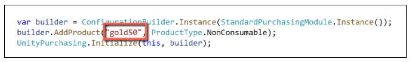

3. Build a [signed non-Development Build Android APK](android) from your game. 

    **TIP:** Make sure you safely store your keystore file. The original keystore is always required to update a published Google Play application. 

    **TIP:** Reuse the Bundle Version Code from your last uploaded APK during local testing to permit side-loading without first being required to upload the changed APK to the Developer Console. See the settings for the [Android platform Player](class-PlayerSettingsAndroid).

### Register the Application

From the Google Account that will publish the game, register the Android application with the [Google Play Developer Console](https://play.google.com/apps/publish).

**NOTE:** This guide uses the [Google Play Alpha/Beta Testing approach](http://developer.android.com/google/play/billing/billing_testing.html) for testing in-app purchase integration. 

**NOTE:** A restriction against using the publisher's Google Account for testing exists, because Google payments does not let you buy items from yourself. Therefore you will need to create a non-publisher Google Account for testing.

1. Choose __Add new application__.

    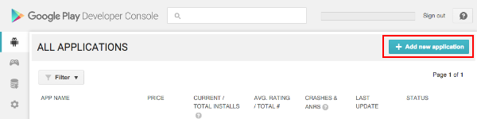

2. Give the application a Title. For configuring application billing, choose "Upload APK" now. The Store Listing will be prepared and populated in a later step.

    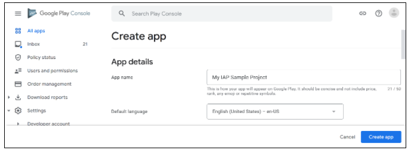

3. Navigate to __ALPHA TESTING__ and choose __Upload your first APK to Alpha__. Select your APK and upload it.

    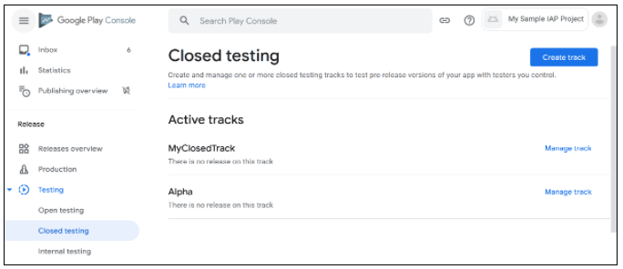

4. Resolve any issues listed in the __Why can't I publish?__ popup first, then click __Publish app__ to publish your Alpha application. 

    **TIP**: There may be a delay of up to 24 hours while the published Alpha application is made available for download from the Google Play Store. Similarly, there may be a 24-hour delay to published changes to an application's In-App Purchases (see below).

    **WARNING**: Make sure the published application is the Alpha version. If the Production version is published, the general public will have access to the untested application.

    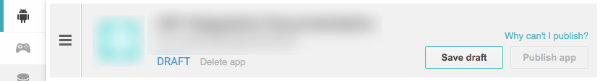

### Add In-App Purchases

In the Developer Console, add one or more in-app purchases for the game.

1. Navigate to __In-app Products__ and choose __Add new product__.

    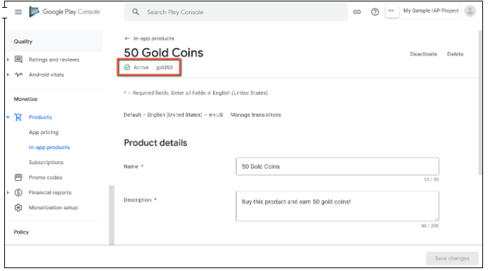

1. Define the __Product ID__ and choose __Continue__. 

    You can specify a consumable or non-consumable Product Type in __Managed product__. __Subscription__ is also supported by Unity IAP.

**NOTE**: The "Product ID" here is the same identifier used in the game source code, added to the [Unity IAP ConfigurationBuilder](xref:UnityEngine.Purchasing.ConfigurationBuilder) instance via `AddProduct()` or `AddProducts()`. 

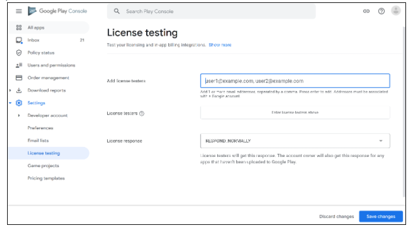

1. Populate the IAP's __Title__, __Description__, and __Default price__. Then enable it by changing the __Inactive__ button to __Active__. 

    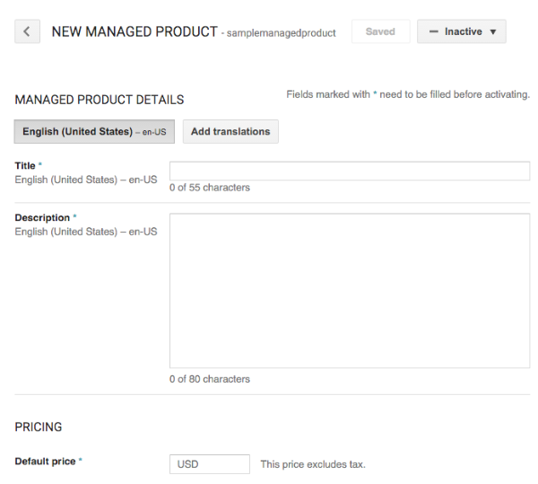
  
    Result:
  
    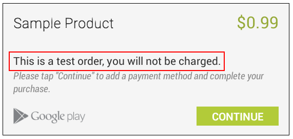

### Test IAP

Follow these instructions to assign "test users" to be granted special license testing permissions, allowing them to purchase any IAP for free for this application, and register them as Alpha Testers.

**NOTE**: Here we used [Closed Alpha Testing](https://support.google.com/googleplay/android-developer/answer/3131213). Other tester groupings are available. 

1. Add Google Account email addresses for testers who will be granted a license to purchase any IAP for free via the Developer Console's __Settings &gt; Account details &gt; LICENSE TESTING__ section.

    NOTE: There may be a delay of 15 minutes for the license testing setting to become effective.
  
    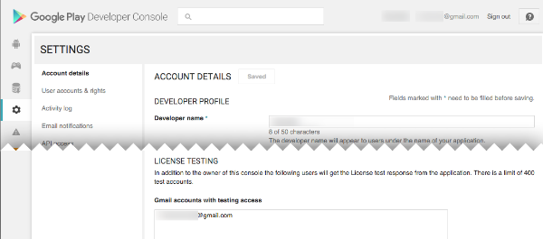

2. Establish a list of Alpha Tester Google Account email addresses, from your list of license testing users.
  
    

    Add each Google Account email address and name the list.
  
    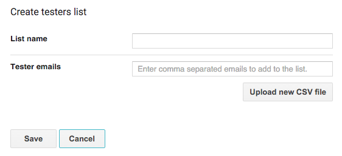

3. When available (after a multi-hour delay starting from publishing the APK) share the **Opt-in URL** with the Alpha Testers and have them install the application from the store.

    **NOTE**: To test updates retaining permission to purchase IAP's for free, one may side-load applications, updating the existing store-downloaded APK install. 

    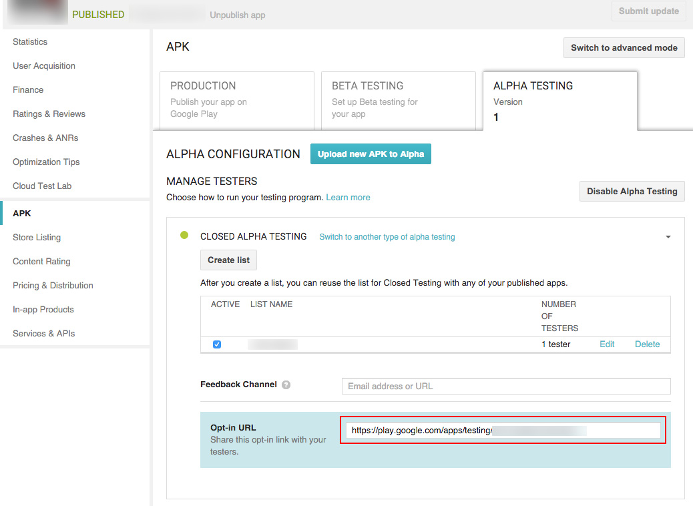

4. To test the IAP, make a purchase on a device logged in with an Alpha Tester Google Account. A modified purchase dialog box appears to confirm the fact this product is under test and is free.

    **WARNING**: If this dialog box does not appear, then the Alpha Tester Google Account will be charged real money for the product.
  
    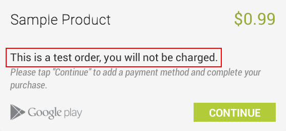

