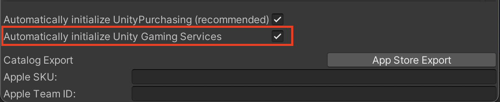

# Initialize Unity Gaming Services

Call `UnityServices.InitializeAsync()` to initialize all **Unity Gaming Services** at once.
It returns a `Task` that enables you to monitor the initialization's progression.

#### Example
```cs
using System;
using Unity.Services.Core;
using Unity.Services.Core.Environments;
using UnityEngine;

public class InitializeUnityServices : MonoBehaviour
{
    public string environment = "production";

    async void Start()
    {
        try
        {
            var options = new InitializationOptions()
                .SetEnvironmentName(environment);

            await UnityServices.InitializeAsync(options);
        }
        catch (Exception exception)
        {
            // An error occurred during services initialization.
        }
    }
}
```

### Automatic initialization

Instead, you may enable **Unity Gaming Services** automatic initialization by checking the **Automatically initialize Unity Gaming Services** checkbox at the bottom of the **IAP Catalog** window.
This ensures that **Unity Gaming Services** initializes immediately when the application starts.

To use this feature **Automatically initialize UnityPurchasing (recommended)** must be enabled.

This initializes **Unity Gaming Services** with the default `production` environment.
This way of initializing **Unity Gaming Services** might not be compatible with all other services as they might require special initialization options.
If the use of initialization options is needed, **Unity Gaming Services** should be initialized with the coded API as described above.

## Warning message

If you attempt to use the **Unity IAP** service without first initializing **Unity Gaming Services**, you will receive the following warning message:
```
Unity In-App Purchasing requires Unity Gaming Services to have been initialized before use.
Find out how to initialize Unity Gaming Services by following the documentation https://docs.unity.com/ugs-overview/services-core-api.html#InitializationExample
or download the 06 Initialize Gaming Services sample from Package Manager > In-App Purchasing > Samples.
```

## Technical details

The `InitializeAsync` methods affect the currently installed service packages in your Unity project.

Note that this method is not supported during edit time.

___
For more information, please see the [Services Core API documentation](https://docs.unity.com/ugs-overview/services-core-api.html#Services_Core_API).

Download the `06 Initialize Gaming Services` from `Package Manager > In-App Purchasing > Samples` for a concrete example.
