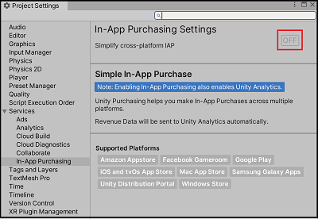
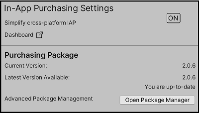
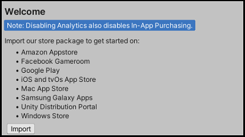

#Setting up Unity IAP

Once you have [set up your project for Unity Services](#SettingUpProjectServices), you can enable the Unity IAP service. To enable Unity IAP in your project:

1. In the Unity Editor, open the **Services** window (**Window** > **General** > **Services**), and click **In-App Purchasing**. 
2. In the **In-App Purchasing** section of the **Project Settings** menu, click the **OFF** button to enable the service.

**Note**: Enabling Unity IAP also enables Unity Analytics in your project.

Unity will automatically import the latest verified In-App Purchasing [package](#pack-alpha). If you’ve already imported a version of the package, you can open the [Package Manager](#Packages) from this menu to update or modify your previous installation.

Click **Import** to import Unity’s IAP’s store package Asset to access app store functionality on the following platforms:  

The Unity IAP Installer will take you through the [Asset package import](#AssetPackages) process. This adds a new folder _Assets_/_Plugins_ to your project, containing the Unity Purchasing assets required to use Unity IAP. For more information, see documentation on [store guides](#UnityIAPiOSMAS).

## Common Unity IAP integration compiler errors
The following error messages may indicate that Unity IAP is disabled in the Unity Cloud Services window, or that Unity is disconnected from the Internet:

* `CS0246`
* `System.Reflection.ReflectionTypeLoadException`
* `UnityPurchasing/Bin/Stores.dll`
* `UnityEngine.Purchasing`

To resolve these errors: 

1. Reload the Services window by closing, then reopening it. Once reloaded, ensure that the Unity IAP service is enabled.
2. If this doesn’t work, try disconnecting and reconnecting to the Internet, then sign back into Unity Services and re-enable Unity IAP. 

**Note**: You must have an “Owner” or “Manager” [role](#OrgsManagingyourOrganization) for the project’s registered Organization to enable the Unity IAP Service.

